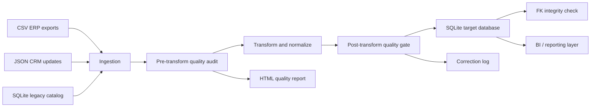
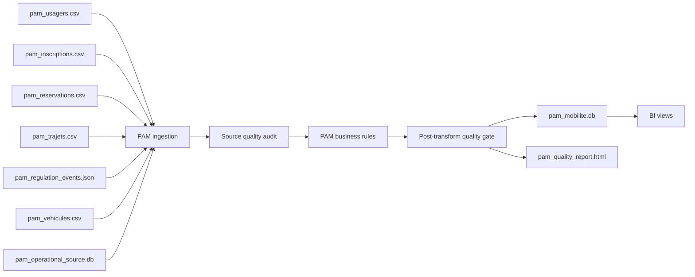

# Architecture

## Pipeline Overview

## Runtime Steps

1. Ingest available sources from the registry in `pipeline/config.py`.
2. Merge optional source updates into the base extracts.
3. Run a pre-transform quality audit to identify source issues.
4. Standardize values, resolve duplicate clients, remap dependent records, remove true orphan references, and resolve tariff conflicts.
5. Run a post-transform quality gate. Critical validity, uniqueness, and consistency issues block loading.
6. Load the cleaned current-state data into a constrained SQLite target schema.
7. Historize corrections and record-level changes across runs.
8. Validate foreign-key integrity after load.

## Main Components

| Component | Responsibility |
| --- | --- |
| `pipeline/ingest.py` | Reads CSV, JSON, and SQLite sources; detects duplicate-key conflicts. |
| `analyse_qualite/validators/` | Implements source and post-transform quality checks. |
| `pipeline/transform.py` | Cleans data, resolves duplicates, remaps references, and applies business rules. |
| `pipeline/schema.py` | Creates the normalized target database with keys, indexes, and constraints. |
| `pipeline/load.py` | Loads clean data in foreign-key-safe order. |
| `pipeline/historize.py` | Records runs, corrections, and inserts/updates/deletes. |
| `analyse_qualite/report.py` | Builds the standalone HTML audit report. |

## Target Model

The target database is a compact operational model:

- `clients`: master data for customers / partners / passengers.
- `produits`: service or product catalog.
- `affaires`: operational or commercial records linked to clients.
- `tarifs`: current tariff grid linked to products and clients.

The target table `tarifs` enforces one current row per `produit_id + client_id`. Source conflicts are resolved before load and logged in the correction history.

## PAM-Specific Module

The `pam_pipeline/` package adds a dedicated transport/PAM case study aligned with the Keolis/Kisio role.

The PAM module focuses on:

- service registrations;
- bookings and trip planning;
- vehicle assignment;
- real-time regulation events;
- SQL operational reservation updates;
- accessibility constraints;
- RGPD-sensitive operational data.
